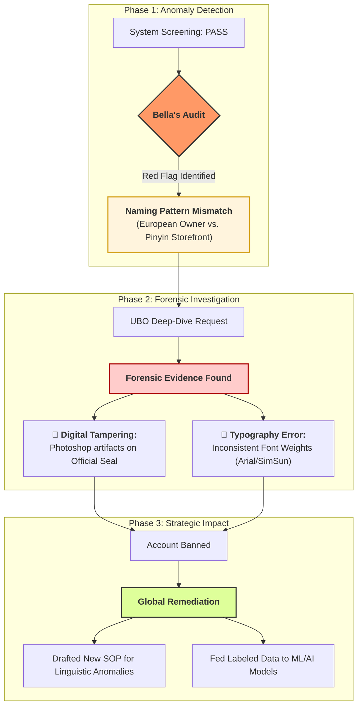

# Case Study: Financial Crime Investigation @Amazon
## Detecting Proxy Account Networks via Anomaly Pattern Recognition

## 🔍 Executive Summary
In high-volume e-commerce ecosystems, fraudulent actors often use **Proxy Accounts (Straw Man Accounts)** to bypass regional restrictions. This case study details how I identified a sophisticated cross-border fraud ring by detecting "Naming Pattern Mismatches" that automated systems missed, and how I subsequently optimized the global risk-mitigation workflow.

---

## 🚩 Phase 1: Detection – The "Pinyin" Anomaly
While auditing a high-tier European seller account (registered under a local European identity), I identified a critical **Red Flag**:
* **The Anomaly:** The "Storefront Name" followed a distinct **Mandarin Pinyin naming logic** (e.g., *XingLong-Industrial-Ltd*), creating a logical conflict with the European registrant's profile.
* **The Gap:** Standard automated filters verified the identity documents but failed to cross-reference linguistic or cultural patterns in the metadata, allowing proxy sellers to create market presence undetected.

---

## 🕵️ Phase 2: Deep-Dive – Forensic Document Audit
To validate my hypothesis, I initiated an unannounced **Ultimate Beneficial Owner (UBO)** verification.
* **Evidence Gathering:** Analyzed the submitted Organizational Charts and Identity Proofs.
* **Forensic Findings:** * **Digital Tampering:** Identified subtle "Photoshop artifacts" and pixel inconsistencies in the document layers.
    * **Typographical Errors:** Noted inconsistent font types and spacing, confirming the documents were sophisticated forgeries.
* **Conclusion:** Confirmed the account was part of a larger network of Chinese sellers using hijacked or purchased European identities to circumvent marketplace regulations.

---

## 🛠️ Phase 3: Remediation – From Intuition to Scalable Strategy
Instead of merely closing the account, I focused on **Operational Risk Mitigation** to prevent future occurrences:
1. **Standardized SOP:** Authored a new investigative SOP for "Linguistic & Geographical Pattern Cross-Validation," now utilized by the peer audit team.
2. **AI Data Feeding:** Labeled the confirmed fraudulent data points and fed them back into the **Machine Learning (ML) models**, enhancing the system's ability to auto-detect similar proxy patterns globally.
3. **Knowledge Base Expansion:** Contributed to the internal "Risk Modus Operandi" database to increase collective detection accuracy.

---

## 📈 Business Impact
* **Systemic Risk Reduction:** Successfully closed a high-risk loophole that allowed unauthorized cross-border market entry.
* **Enhanced Detection Accuracy:** The new SOP reduced the investigation time for similar proxy cases by approximately 20%.
* **Operational Excellence:** Transitioned a "human intuition" discovery into a "digital asset" for the company’s AI infrastructure.

---

## 🛠️ Skills & Competencies
`Operational Risk` `FinCrime Investigation` `Anomaly Detection` `UBO Verification` `SOP Development` `Machine Learning Data Labeling`
